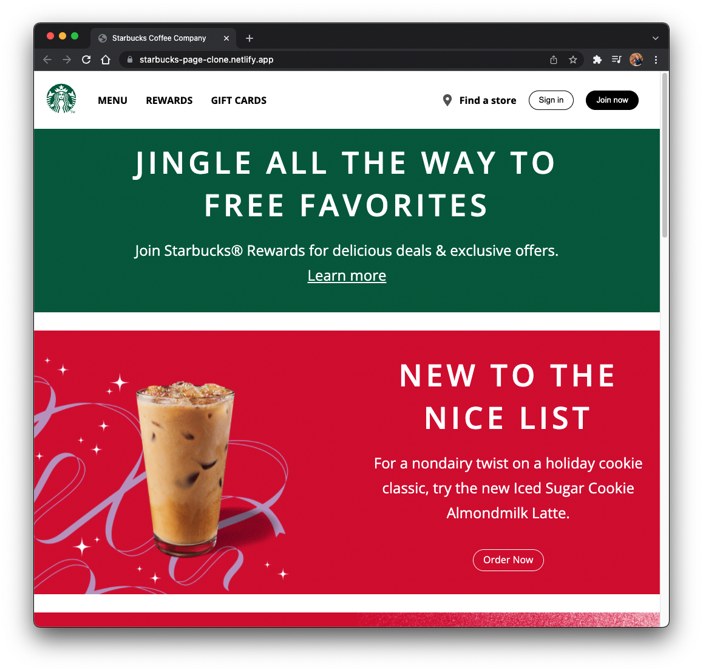

# Starbucks-Landing-Page-Clone

Building a responsive clone of the homepage of Starbucks.com from scratch with HTML, CSS and JavaScript. and deploy it on netlify.com

## Please visit the website and try

<a href="https://starbucks-page-clone.netlify.app" target="_blank">`Starbucks-Landing-Page-Clone`</a>

